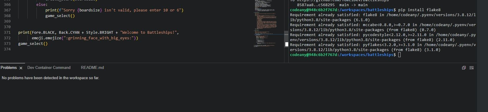

# Battleships - Testing

## Testing

Testing was conducted at several stages throughout the development using python3 run.py command to identify any errors or exceptions. Further testing was later done via the Heroku app and using the flake8 validator.

Early issues identified in meetings with my mentor were:

- Maintaining good comments throughout the code, using doc strings to clearly explain the purpose of functions. 
- Refactoring where possible, to avoid repetition in functions.
- Separating functions into smaller, atomic functions where possible to avoid larger complex functions. 

Later issues on first deploying my game, reviewed with my mentor were:

- Colorama library not importing properly, causing an error when run from Heroku. Solved with proper requirements.txt. 

## CONTENTS

- [Automated Testing](#automated-testing)
- [Flake8 Testing](#flake8-testing)
- [Pylint](#pylint)
- [First Time Visitors](#first-time-visitors)
- [Return Visitors](#return-visitor)
- [Full Testing](#full-testing)
- [Bugs](#bugs)
- [Solved Bugs](#solved-bugs)
- [Known Issues](#known-issues)

## Automated Testing

### Pep8 Automated Testing

#### Flake8 Testing

To ensure compliance with pep8 standard throughout my code, I attempted to install the flake8 validator after online research. However it appears this may already be present in the template used for this project. There are no problems in this project with this built in validator. 

#### Pylint

To be thorough I also tried to install pylint for a second pep8 test and recieved a similar message to the above. No issues registered in IDE. 

## Manual Testing

### Testing User Stories

#### First Time Visitors

| Aim                                                 | How does the site achieve this?                                                                                                                                                                                                   |
| :-------------------------------------------------- | :-------------------------------------------------------------------------------------------------------------------------------------------------------------------------------------------------------------------------------- |
| Find out how to play the game                       | The instructions, accessible from the welcome message of the battleships game give clear indications on how to play the game.                                                                                                                             |
| Start the game easily                               | The game can be started very easily with or without reading the instructions.                                                        |

#### Return Visitor

| Aim                                                    | How does the site achieve this?                                                                                                                                         |
| :----------------------------------------------------- | :---------------------------------------------------------------------------------------------------------------------------------------------------------------------- |
| Quickly play a new game without having to read instructions | A game can be immediately started and the instructions skipped |
| Play with a different board size for variety                                       | A board size of either 6 or 10 can be selected at the beginning of each game, this can be done from the very start of the game, or after the option to replay the game                                                 |

## Full Testing

Full testing of the website was performed on a Dell optiplex desktop on 25 inch Toshiba and Soundwave monitors, Dell Latitude 5510 14 inch screen laptop, iPad 8th generation, Samsung Galaxy S10, iPhone 14 pro.

Testing was conducted using Google Chrome, MS Edge and Safari.

| Feature/Function    | Expected Outcome                                          | Method of Test    | Result                           | Pass/Fail |
| :------------------ | :-------------------------------------------------------- | :---------------- | :------------------------------- | :-------- |
| WELCOME MESSAGE     |                                                           |                   |                                  |
| Welcome message     | Welcome to Battleships! Text appears on game load         | Loaded game       | Text appeared                    | Pass      |
| Colorama and Emoji  | Text is white with cyan background with smiling emoji| Loaded game       | Coloured text and emoji appeared | Pass      |
| GAME BOARD CREATE   |                                                           |                   |                                  |           |
| User input text     | Text appears prompting user to enter 6 or 10              | Loaded game       | Text appeared                    | Pass      |
| Correct Input pass  | Input of either 6 or 10 is passed to function and game begins | Entered 6 or 10 | Input accepted, game begins    | Pass      |
| Incorrect Input Validated | Input other than 6 or 10 does not progress game and user is asked to enter another value, without the game restarting | Entered different value to 6 or 10      | Message printed to user asking them to try again without exiting the game  | Pass      |
| DISPLAY BOARDS      |                                                           |                   |                                  |           |
| Display Player Board | "Game board" is displayed row by row, with column letters across the top and numbers on the left for the rows, with ship values shown horizontally at random points, each on a separate row.              | Entered 6 to create board      | Game board with ships placed displayed row by row | Pass      |
| Display "Fired on" Board   | Display blank board with lettered columns and numbered rows                | Entered 6 to create boards      | Blank "fired on" board displayed row by row   | Pass      |
| Explanation messages for boards displayed in green  | Brief messages explaining the players board with ships, and blank board for 'fired on' displayed with the relevant board               | Entered 6 to create boards      | Messaged displayed in green as expected  | Pass      |
| PLAYER FIRE FUNCTION            |                                                           |                   |                                  |
| Player enter fire coordinates         | When entered in correct format, player input will be taken as fire coordinates and game will progress    | Valid fire coordinates (letter),(number) entered      | Message presented with fire coordinates and game progressed      | Pass      |
| Invalid player fire coordinates    | Error is captured as IndexError exception and user is prompted to enter valid coordinates without the game exiting/restarting | Entered invalid coordinates     | Message presented prompting to re enter valid coordinates without exiting the game | Pass      |
| Player Hit    | Message presented declaring Hit! With a smiley emoji, the 'fire board' is displayed with a H in the grid reference, coordinates added to player shot store  | Entered coordinates with computer ship present      | Hit! Message displayed with a H shown in the corresponding grid reference   | Pass      |
| Player Miss    | Message printed declaring a miss, an X is shown in the relevant grid reference on the 'fire board', coordinates added to player shot store  | Entered fire coordinates without a computer ship present      | Miss message printed, X shown in relevant grid reference on 'fire board', coordinated added to player shot store   | Pass |
| Player Repeat Fire     | When entering coordinates that have already been fired on, message presented explaining that these have already been fired on and player should re enter different coordinates without exiting game.              | Enter same fire coordinates twice       | Message appears with prompt to try again and game is not exited             | Pass      |
| COMPUTER FIRE FUNCTION            |                                                           |                   |                                  |
| Computer fires after player | Random, valid fire coordinates are created after the player has fired, with message declaring "incoming enemy fire" | Valid player fire is passed                 | Computer fire coordinates are created and message is displayed | Pass |
| Computer Hit    | Message presented declaring We've been hit!, the player board is displayed with a H in the grid reference, coordinates added to computer shot store  | Played until computer created coordinates with player ship in      | We've been hit! Displayed, the player board is displayed with a H in the grid reference, coordinates added to computer shot store   | Pass      |
| Computer Miss    | Message printed declaring "The enemy missed us", an X is shown in the relevant grid reference on the 'fire board', coordinates added to computer shot store | Played until computer coordinates with no player ship present      | Message printed declaring "The enemy missed us", an X is shown in the relevant grid reference on the 'fire board', coordinates added to computer shot store   | Pass |
| SHIP SUNK FUNCTION            |                                                           |                   |                                  |
| Message Declaring Ship Sunk  | When a ship no longer exists on player or computer board "Ship sunk message" is displayed | Played game until ship 'sunk' (value no longer exists on relevant board       | Ship sunk message displayed | Pass      |
| END GAME            |                                                           |                   |                                  |
| Player Victory  | When no more computer ships are present, game is ended, message is presented to player declaring they have won and option to start another game is presented | Played until all computer ships sunk | Victory message printed, game ended and option to play again presented | Pass      |
| Computer Victory  | When no more player ships are present, game is ended, message is presented to player declaring they have lost and option to start another game is presented | Played until all player ships sunk | Defeat message printed, game ended and option to play again presented | Pass      |

## Bugs

### Solved Bugs

1. Changing Values on Board copying across all rows - Early in the project I ran into an issue when trying to 'place the ships' on the game board. The function for this was essentially changing some of the zero's on the blank created game board, to different numbers, to represent the places of different ships. To do this I began the function by accessing a particular index on a particular row, a 'grid coordinate', and changing this to a different value. However when doing this I found the value would be copied across all rows for that particular index, essentially creating an entire column of a value, instead of just an individual index in an individual row. After researching I found this is a commonly encountered problem across different elements of Python, and is essentially related to Pythons nature of referring to the original object in different functions, value changes etc, rather than treating each interaction with the object as creating a new object. The solution I found to this was to use a list comprehension, rather than a for loop. Using this method to create the list of lists, the board, allowed each index in each row to be accessed and changed individually, without effecting the rest of the board. It also had the added bonus of refactoring the code and making the function much more concise. 

2. Placing Ships within Board Values - A challenge which I ran into was ensuring that when placed, ships would be placed randomly but within the board values, so that the row-lists were not extended with ships essentially being placed off the edge of the board. I wanted to make the ship placement random as it would remove an area for user input error whilst also keeping the game unique on each play. To solve this challenge I eventually decided on a solution that captured the length of a row, then subtract the ship value from this row length. The placement function then creates a random number between this value, and 1, and uses this value as the row index from where the start of the ship will be placed on the row. 
For example, if the board had a row size of 10, and a battleship was being placed with a value of 4, the function would create a random value between 1 - 6. It would then use this value as an index for the row. The ship would then be placed from the row. So the random number generated was 5, then indexes 5,6,7,8 would be changed to the value of 4, and the battleship has essentially been placed.
If the board was a size of 6, and a battleship with a value of 4 was being placed, the random number generated would be 1 or 2. If the number generated was 2, the same process would follow and indexes 2,3,4,5 would be changed to 4 and the battleship would be placed.
This method ensures that the board row length can be used generically for either boards of 6 or 10 size, for every ship length, and the ship will never be placed off the board. 

3. Game Board View - With standard print statements, the game board was displayed in the command panel as sequential lists of lists. These were entirely accurate but were difficult to follow and greatly detracted from the game play experience. A simple function I developed to solve this was simply to print the board row by row, which gave a much better view of the board, the place of ships, and could also be used to show where the player had already fired/been fired on. These print statements produced a view much closer to an actual battleships board, however because the top line was populated with strings for letters, these included quote marks and so the columns didn't quite line up with the rest of the board.

4. Unique Player and Computer Boards - When refactoring the functions, I wanted to simplify the functions for creating the player and computer board. I realised that it was only the ship placement that needed to be unique between the player and computer board, so I made a generic function to feed a blank board into a ship placement board. However I ran into an issue where both boards were being produced, with both groups of ships, which was resulting in a mess of overlapping ships/values etc. After researching I discovered the deep copy function in python which allowed for 'truly unique' instance of an object to be created and this allowed 1 function 2 create 2 distinct 'blank boards' which could be given to the place ship function. 

### Known Issues

1. Colorama Background on Welcome Message - Sometimes, the coloured background on the welcome message extends for 2 lines beyond the Welcome to Battleships text. There doesn't seem to be a pattern to how or why this happens and so I haven't been able to resolve it.

2. Column 10 - On a boardsize of 10 the, the 10 itself at the top of the board, being one character greater than all the other items on the board stands slightly proud. This is a minor aesthetic issue and it does not seem there is a simple way to centre characters without spoiling the layout of the rest of the board.

3. Computer Sinking Player Ship - The check ship sunk function does not always work as intended when the computer has, or hasn't sunk a ship. There is an unusual behaviour for the function to say the computer has sunk a ship when this hasn't actually happened, often around 4 or 5 hits. From testing, the function knows which ship value is being passed to it, therefore it scans, and knows that that ship still exists on the players board, in the same way that the function works, correctly, for when the player sinks a ship. However it does inconsistently state "the enemy sunk our ship" when this isn't the case, despite my best efforts I have not been able to find out why this is within the project timeframe. 